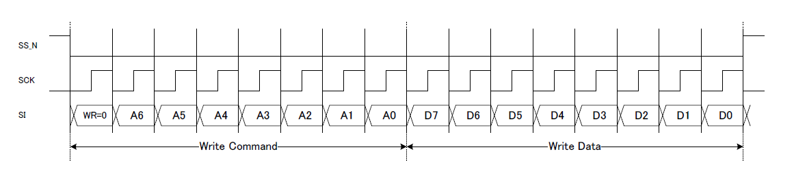
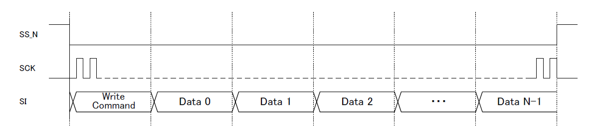
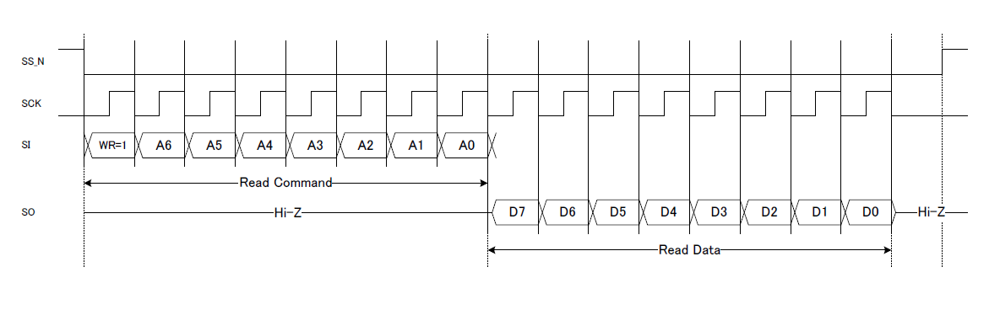

# YMF825(SD-1) IF specification

## 注意

本書はSD-1仕様書に基づいて作成していますが、YMF825Boardに必要な情報のみ記載しています。 そのため、SD-1の完全仕様ではありませんので、あらかじめご了承ください。
また、本書に掲載されている内容に基づいて、SD-1を使用した結果の保証はいたしかねますので、あらかじめご了承ください。

+ 本文書は翻訳日本語版です。日本語では不自然となる重複する形容表現は省略されている場合があります。
## 特徴

+ 16ボイスのポリフォニックFMシンセサイザー
+ 29のオンチップオペレーター波形と8つのアルゴリズムにより、さまざまなサウンドを提供

+ ホストコントローラーインターフェイス用の同期シリアルデータリンク
+ 内蔵スピーカードライバー（外部アンプ接続もサポート）
+ 内蔵3バンドイコライザー
+ 内蔵16ビットモノラルDAC

## Interface Register

### System Setting

+ I_ADR＃0-2、4、29にはALRSTが "1"の場合でもアクセスできますが
他のレジスタにはALRSTが "0"の場合にのみアクセスできます。

| I_ADR | Name | W/R | D7 | D6 | D5 | D4 | D3 | D2 | D1 | D0 | Reset Value |
|-|-|-|-|-|-|-|-|-|-|-|-|
|#0| Clock Enable |W/R|"0"|"0"|"0"|"0"|"0"|"0"|"0"|CLKE|00H |
|#1|Reset|W/R|ALRST|"0"|"0"|"0"|"0"|"0"|"0"|"0"|80H|
|#2|Analog Block Power-down control|W/R|"0"|"0"|"0"|"0"|AP3|AP2|AP1|AP0| 0FH|
|#3|Speaker Amplifier Gain Setting|W/R|"0"|"0"|"0"|"0"|"0"|"0"|GAIN1|GAIN0|01H|
|#4|Hardware ID|R|"0"|"0"|"0"|"0"|"0"|"0"|"0"|"1"|01H|
|#5|Interrupt|W/R R|"0"|"0"|"0"|EMP_DW|"0"|FIFO|"0"|SQ_STP|00H|
|#6||W/R|"0"|EIRQ|"0"|EEMP_DW|"0"|EFIFO|"0"|ESQ_STP|00H|
|#7|Contents Data Write Port|W|DT7|DT6|DT5|DT4|DT3|DT2|DT1|DT0|00H|
|#8|Sequencer Setting|W/R|AllKeyOff|AllMute|AllEGRst|R_FIFOR|REP_SQ|R_SEQ| R_FIFO|START|00H|
|#9||W/R|SEQ_Vol4|SEQ_Vol3|SEQ_Vol2|SEQ_Vol1|SEQ_Vol0|DIR_SV|"0"|SIZE8|00H|
|#10||W/R|SIZE7|SIZE6|SIZE5|SIZE4|SIZE3|SIZE2|SIZE1|SIZE0|00H|
|#11|Synthesizer Setting|W/R|"0"|"0"|"0"|"0"|CRGD_VNO3|CRGD_VNO2|CRGD_VNO1|CRGD_VNO0|00H|
|#12||W|"0"|VoVol4|VoVol3|VoVol2|VoVol1|VoVol0|"0"|"0"|60H|
|#13||W|"0"|"0"|FNUM9|FNUM8|FNUM7|BLOCK2|BLOCK1|BLOCK0|00H|
|#14||W|"0"|FNUM6|FNUM5|FNUM4|FNUM3|FNUM2|FNUM1|FNUM0|00H|
|#15||W|"0"|KeyOn|Mute|EG_RST|ToneNum3|ToneNum2|ToneNum1|ToneNum0|00H|
|#16||W|"0"|ChVol4|ChVol3|ChVol2|ChVol1|ChVol0|"0"|DIR_CV|60H|
|#17||W|"0"|"0"|"0"|"0"|"0"|XVB2|XVB1|XVB0|00H|
|#18||W|"0"|"0"|"0"|INT1|INT0|FRAC8|FRAC7|FRAC6|08H|
|#19||W|"0"|FRAC5|FRAC4|FRAC3|FRAC2|FRAC1|FRAC0|"0"|00H|
|#20||W|"0"|"0"|"0"|"0"|"0"|"0"|"0"|DIR_MT|00H|
|#21|Control Register Read Port|W/R|RDADR_CRG7|RDADR_CRG6|RDADR_CRG5|RDADR_CRG4|RDADR_CRG3|RDADR_CRG2|RDADR_CRG1|RDADR_CRG0|00H|
|#22||R|"0"|RDDATA_CRG6|RDDATA_CRG5|RDDATA_CRG4|RDDATA_CRG3|RDDATA_CRG2|RDDATA_CRG1|RDDATA_CRG0|-|
|#23|Sequencer Time unit Setting|W/R|"0"|MS_S13|MS_S12|MS_S11|MS_S10|MS_S9|MS_S8|MS_S7|00H|
|#24||W/R|"0"|MS_S6|MS_S5|MS_S4|MS_S3|MS_S2|MS_S1|MS_S0|00H|
|#25|Master Volume|W/R|MASTER_VOL5|MASTER_VOL4|MASTER_VOL3|MASTER_VOL2|MASTER_VOL1|MASTER_VOL0|"0"|"0"|00H|
|#26|Soft Reset|W/R|SFTRST7|SFTRST6|SFTRST5|SFTRST4|SFTRST3|SFTRST2|SFTRST1|SFTRST0|00H|
|#27|Sequencer Delay, Recovery Function Setting, Volume Interpolation Setting|W/R|"0"|DADJT|MUTE_ITIME1|MUTE_ITIME0|CHVOL_ITIME1|CHVOL_ITIME0|MVOL_ITIME1|MVOL_ITIME0|00H|
|#28|LFO Reset|W/R|"0"|"0"|"0"|"0"|"0"|"0"|"0"|LFO_RST|00H|
|#29|Power Rail Selection|W/R|"0"|"0"|"0"|"0"|"0"|"0"|"0"|DRV_SEL|00H|
|#30|Reserved|||||||||||
|#31|Reserved|||||||||||

Note

+ シンセサイザ設定のI_ADR＃12-19を書き込む前に、チャネル番号をCRGD_VNO [3：0]（I_ADR＃11）に書き込む必要があります。
### EQ Coeffcient Setting

|I_ADR|Name|W/R|D7-D0|Reset Value|
|-|-|-|-|-|
|#32|EQ BAND0 coefficient Write Port|W|W_CEQ0[7:0]|00H|
|#33|EQ BAND1 coefficient Write Port|W|W_CEQ1[7:0]|00H|
|#34|EQ BAND2 coefficient Write Port|W|W_CEQ2[7:0]|00H|
|#35|Equalizer Coefficient Read Ports|R|CEQ00[23:16]|10H|
|#36||R|CEQ00[15:8]|00H|
|#37||R|CEQ00[7:0]|00H|
|#38||R|CEQ01[23:16]|00H|
|#39||R|CEQ01[15:8]|00H|
|#40||R|CEQ01[7:0]|00H|
|#41||R|CEQ02[23:16]|00H|
|#42||R|CEQ02[15:8]|00H|
|#43||R|CEQ02[7:0]|00H|
|#44||R|CEQ03[23:16]|00H|
|#45||R|CEQ03[15:8]|00H|
|#46||R|CEQ03[7:0]|00H|
|#47||R|CEQ04[23:16]|00H|
|#48||R|CEQ04[15:8]|00H|
|#49||R|CEQ04[7:0]|00H|
|#50||R|CEQ10[23:16]|10H|
|#51||R|CEQ10[15:8]|00H|
|#52||R|CEQ10[7:0]|00H|
|#53||R|CEQ11[23:16]|00H|
|#54||R|CEQ11[15:8]|00H|
|#55||R|CEQ11[7:0]|00H|
|#56||R|CEQ12[23:16]|00H|
|#57||R|CEQ12[15:8]|00H|
|#58||R|CEQ12[7:0]|00H|
|#59||R|CEQ13[23:16]|00H|
|#60||R|CEQ13[15:8]|00H|
|#61||R|CEQ13[7:0]|00H|
|#62||R|CEQ14[23:16]|00H|
|#63||R|CEQ14[15:8]|00H|
|#64||R|CEQ14[7:0]|00H|
|#65||R|CEQ20[23:16]|10H|
|#66||R|CEQ20[15:8]|00H|
|#67||R|CEQ20[7:0]|00H|
|#68||R|CEQ21[23:16]|00H|
|#69||R|CEQ21[15:8]|00H|
|#70||R|CEQ21[7:0]|00H|
|#71||R|CEQ22[23:16]|00H|
|#72||R|CEQ22[15:8]|00H|
|#73||R|CEQ22[7:0]|00H|
|#74||R|CEQ23[23:16]|00H|
|#75||R|CEQ23[15:8]|00H|
|#76||R|CEQ23[7:0]|00H|
|#77||R|CEQ24[23:16]|00H|
|#78||R|CEQ24[15:8]|00H|
|#79||R|CEQ24[7:0]|00H|

### Software Communication Check

| I_ADR | Name | W/R | D7 | D6 | D5 | D4 | D3 | D2 | D1 | D0 | Reset Value |
|-|-|-|-|-|-|-|-|-|-|-|-|
|#80|Software test communication|W/R|COMM7|COMM6|COMM5|COMM4|COMM3|COMM2|COMM1|COMM0|00H|

## Read/Write Accesses to Interface Registers

### SPI Specification
+ MSB first
+ Mode 0
+ max 10MHz

### Single Write

1回の書き込みアクセスには2バイト（16ビット）が必要です。1バイトの書き込みコマンドと1バイトの書き込みデータです。
必ず2バイト（16ビット）でアクセスしてください。
/ SSピンは、2バイトの書き込みアクセスごとに "H"に設定する必要があります。

### Burst Write

Burst Writeでは、データを同じインターフェイスレジスタアドレスに連続して書き込むことができます。
次のように、1つの書き込みコマンドに対して複数のデータを連続して入力します：[書き込みコマンド+データ+データ+ ...]。
Burst Writeのモードでは、/ SSピンが "H"になる事を書き込みアクセスの終了と解釈します。 したがって、このピンはバースト書き込み操作中は"H"を保つ必要があります。
各データは1バイトでなければなりません。 不正な書き込み操作が原因で/ SS端子が6ビットなど1バイト未満で "H"に設定された場合、異常動作が発生する場合があります。

### Read Access

WR（コマンド）ビットを "1"に設定する事で、読み取りアクセスコマンドを送信します。
読み出したデータは、9クロック目からSCKの立ち下がりエッジに同期して送信されます。
データはMSBファースト形式（D7→D0）です。
SOピンの詳細を以下に示します。
+ 後半の8クロックサイクル中に、読み取りデータ（D [7：0]）はMSBファーストフォーマットで送信されます。
+ データが読み取られていないときは常に、SOピンはハイインピーダンス状態（Hi-Z）になります。

## Tone Parameter Memory Map

|T_ADR|Name|D7|D6|D5|D4|D3|D2|D1|D0|
|-|-|-|-|-|-|-|-|-|-|
|#0+30x[tn]|Entire Tone Setting|"0"|"0"|"0"|"0"|"0"|"0"|BO1|BO0|
|#1+30x[tn]||LFO1|LFO0|"0"|"0"|"0"|ALG2|ALG1|ALG0|
|#2+30x[tn]|Operator1 Setting|SR3|SR2|SR1|SR0|XOF|"0"|"0"|KSR|
|#3+30x[tn]||RR3|RR2|RR1|RR0|DR3|DR2|DR1|DR0|
|#4+30x[tn]||AR3|AR2|AR1|AR0|SL3|SL2|SL1|SL0|
|#5+30x[tn]||TL5|TL4|TL3|TL2|TL1|TL0|KSL1|KSL0|
|#6+30x[tn]||"0"|DAM1|DAM0|EAM|"0"|DVB1|DVB0|EVB|
|#7+30x[tn]||MULTI3|MULTI2|MULTI1|MULTI0|"0"|DT2|DT1|DT0|
|#8+30x[tn]||WS4|WS3|WS2|WS1|WS0|FB2|FB1|FB0|
|#9+30x[tn]|Operator2 Setting|SR3|SR2|SR1|SR0|XOF|"0"|"0"|KSR|
|#10+30x[tn]||RR3|RR2|RR1|RR0|DR3|DR2|DR1|DR0|
|#11+30x[tn]||AR3|AR2|AR1|AR0|SL3|SL2|SL1|SL0|
|#12+30x[tn]||TL5|TL4|TL3|TL2|TL1|TL0|KSL1|KSL0|
|#13+30x[tn]||"0"|DAM1|DAM0|EAM|"0"|DVB1|DVB0|EVB|
|#14+30x[tn]||MULTI3|MULTI2|MULTI1|MULTI0|"0"|DT2|DT1|DT0|
|#15+30x[tn]||WS4|WS3|WS2|WS1|WS0|"0"|"0"|"0"|
|#16+30x[tn]|Operator3 Setting|SR3|SR2|SR1|SR0|XOF|"0"|"0"|KSR|
|#17+30x[tn]||RR3|RR2|RR1|RR0|DR3|DR2|DR1|DR0|
|#18+30x[tn]||AR3|AR2|AR1|AR0|SL3|SL2|SL1|SL0|
|#19+30x[tn]||TL5|TL4|TL3|TL2|TL1|TL0|KSL1|KSL0|
|#20+30x[tn]||"0"|DAM1|DAM0|EAM|"0"|DVB1|DVB0|EVB|
|#21+30x[tn]||MULTI3|MULTI2|MULTI1|MULTI0|"0"|DT2|DT1|DT0|
|#22+30x[tn]||WS4|WS3|WS2|WS1|WS0|FB2|FB1|FB0|
|#23+30x[tn]|Operator4 Setting|SR3|SR2|SR1|SR0|XOF|"0"|"0"|KSR|
|#24+30x[tn]||RR3|RR2|RR1|RR0|DR3|DR2|DR1|DR0|
|#25+30x[tn]||AR3|AR2|AR1|AR0|SL3|SL2|SL1|SL0|
|#26+30x[tn]||TL5|TL4|TL3|TL2|TL1|TL0|KSL1|KSL0|
|#27+30x[tn]||"0"|DAM1|DAM0|EAM|"0"|DVB1|DVB0|EVB|
|#28+30x[tn]||MULTI3|MULTI2|MULTI1|MULTI0|"0"|DT2|DT1|DT0|
|#29+30x[tn]||WS4|WS3|WS2|WS1|WS0|"0"|"0"|"0"|

Note

+ T_ADRは、Cotents Format（下記）のTone Settingフォーマットを意味します。
+ tn：音色番号（0-15）　原文(Tone Number)
### Contents Format

Contents Formatは音色情報とメロディコンテンツシーケンスデータで構成されます。
内容は、CPUインターフェイス（I_ADR＃7：CONTENTS_DATA_REG）を介してレジスタに書き込まれます。

#### Data format

+ ヘッダー：1バイト（80H +最大音色番号） 
+ 音色設定データ30〜480バイト（設定された音色の数×30byte）
+ シーケンスデータ（任意のサイズ）   :データフォーマット非公表のため使用出来ない
+ 終了コード（80H、03H、81H、80H）

#### 音色の設定
音色パラメータは、ヘッダーに設定された音色の数によって設定されます。
パラメータは、1つのトーンに対して30バイトのデータで構成されます。
データは、書き込まれた順序で音色番号0からトーンパラメータメモリに転送され、割り当てられます。 したがって、中間の音色番号のパラメータを最初に書き込むことはできません。
トーンパラメータの詳細については、"Tone Parameter"(fbd_spec3.md）をご覧ください。

## 初期化手順

1. デバイスに電源を供給します。

	パワーオンリセットの要件が満たされない場合は、RST_Nピンを "L"に保持して電源に電力を供給する必要があります。

1. 指定されたレベルまで供給電圧が上昇した後、100us待ちます
	この期間は、レギュレータの安定化に必要な時間です。

1. RST_Nピンを "H"に設定します。

	ハードウェアリセット状態が解除されます。
	このデバイスをRST_Nピンを "H"に保持して使用する場合、 "H"に設定する必要はありません。

1. このデバイスを単一の5 V電源で使用する場合は、DRV_SELを「0」に設定します。
	デュアル電源構成で使用する場合は、DRV_SELを "1"に設定してください。

1.	 AP0を「0」に設定します。 VREFに電力が供給されます。

1.	水晶発振のクロックが安定に要する時間待ちます。

1. 	CLKEを "1"に設定し内部回路にクロックを供給します。

1. ALRSTを「0」に設定し内部回路のリセット状態を解除します。

1. SFTRSTを「A3H」に設定しシンセサイザブロックを初期化します。

1. SFTRSTを "00H"に設定します。

1.	ステップ10の後で30ms待ちます。

	この期間は、VREFの安定化とSFTRSTの完了に必要な時間です。

1. AP1とAP3を「0」に設定しオーディオ出力のパワーダウン状態をが解除します。

1. 10uS待ちます。

	この時間は、ポップノイズを防ぐために必要な時間です。今回はシンセサイザーの設定などに使用します。

1. AP2を「0」に設定しオーディオ出力のパワーダウン状態を解除します。

