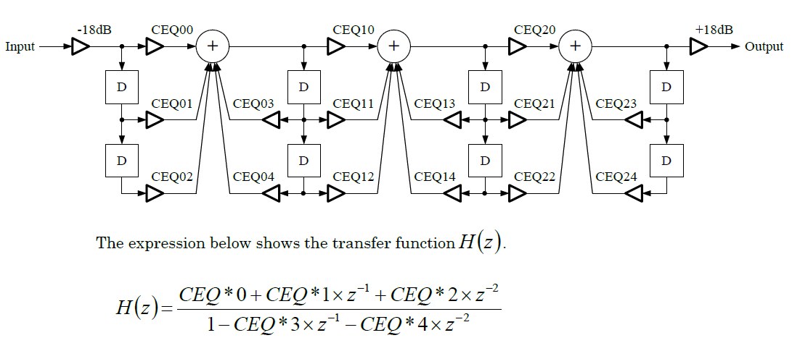

## System Setting

### CLKE

|I_ADR|W/R|D7|D6|D5|D4|D3|D2|D1|D0|Reset Value|
|-|-|-|-|-|-|-|-|-|-|-|
|#0|W/R|"0"|"0"|"0"|"0"|"0"|"0"|"0"|CLKE|00H|

#### Description

CLKEは、内部マスタークロックを制御するためのレジスタビットです。
（有効/無効）。
クロックをアクティブにするには、CLKEを "1"に設定し、ALRSTを "1"に設定します。
時計制御の詳細は「初期化手順」を参照してください。
+ "0"：クロック無効（リセット値）
+ "1"：クロックが有効

#### リセットの条件

1. 電源が投入されたとき（パワーオンリセット）。
2. ハードウェアリセットが適用されたとき（RST_N = "L"）。

### ALRST

| I_ADR | W/R | D7 | D6 | D5 | D4 | D3 | D2 | D1 | D0 | Reset Value |
|-|-|-|-|-|-|-|-|-|-|-|
|#1|W/R|ALRST|"0"|"0"|"0"|"0"|"0"|"0"|"0"|80H|

#### Description

ALRSTは、すべてのインターフェイスレジスタをリセットするために使用されるレジスタです。
+ "0"：リセット状態ではない。
+ "1"：インターフェイスレジスタをリセットします。 （リセット値）

次のインターフェイスレジスタがリセットされます。
+ I_ADR＃3、＃5から＃28、および＃32から＃79

制御レジスタを含む以下のインターフェースレジスタは、このレジスタではリセットされません。
ビット：
+ I_ADR＃0：CLKE
+ I_ADR＃1：ALRST（このレジスタビット）
+ I_ADR＃2：AP0-3
+ I_ADR＃29：DRV_SEL
+ I_ADR＃80：COMM

#### リセットの条件
1. 電源が投入されたとき（パワーオンリセット）。
2. ハードウェアリセットが適用されたとき（RST_N = "L"）。

### AP0, AP1, AP2, AP3

| I_ADR | W/R | D7 | D6 | D5 | D4 | D3 | D2 | D1 | D0 | Reset Value |
|-|-|-|-|-|-|-|-|-|-|-|
|#2|W/R|"0"|"0"|"0"|"0"|AP3|AP2|AP1|AP0|0FH|

#### Description

AP0-3は、アナログブロックのパワーダウンコントロールレジスタビットです。
レジスタビットを「1」（リセット値）に設定すると、パワーダウン状態となり、低消費電力化を実現します。 各レジスタビットとその制御可能ビットの対応

ブロックは次のとおりです。
+ AP0：VREF、IREF
+ AP1：SPAMP、SPOUT1
+ AP2：SPAMP、SPOUT2
+ AP3：DAC

#### リセットの条件
1. 電源が投入されたとき（パワーオンリセット）。
2. ハードウェアリセットが適用されたとき（RST_N = "L"）。

### GAIN

| I_ADR | W/R | D7 | D6 | D5 | D4 | D3 | D2 | D1 | D0 | Reset Value |
|-|-|-|-|-|-|-|-|-|-|-|
|#3|W/R|"0"|"0"|"0"|"0"|"0"|"0"|GAIN1|GAIN0|01H|

#### Description

GAINは、スピーカーアンプのゲインを指定します。

|GAIN1|GAIN0|SPAmplifier|Gain|
|-|-|-|-|
|"0"|"0"|SPOUT|gain =5.0dB|
|"0"|"1"|SPOUT|gain =6.5dB (reset value)|
|"1"|"0"|SPOUT|gain =7.0dB|
|"1"|"1"|SPOUT|gain =7.5dB|

注）上記ゲイン値は無負荷状態時、
8Ωの負荷時ゲインは約0.2 dB（標準）低くなります。
#### Reset Conditions
1. 電源が投入されたとき（パワーオンリセット）。
2. ハードウェアリセットが適用されたとき（RST_N = "L"）
3. ALRSTが "1"に設定されている場合。

### HW_ID

| I_ADR | W/R | D7 | D6 | D5 | D4 | D3 | D2 | D1 | D0 | Reset Value |
|-|-|-|-|-|-|-|-|-|-|-|
|#4|R|"0"|"0"|"0"|"0"|"0"|"0"|"0"|"1"|01H|

#### Description
HW_IDは、ハードウェアバージョン用に読み取り専用状態を保持するために使用されるレジスタです。
値は「01H」（固定）です。
ALRSTビットが「1」に設定されていても値を読み取ることができます。 

### CONTENTS_DATA_REG

| I_ADR | W/R | D7 | D6 | D5 | D4 | D3 | D2 | D1 | D0 | Reset Value |
|-|-|-|-|-|-|-|-|-|-|-|
|#7|W|DT7|DT6|DT5|DT4|DT3|DT2|DT1|DT0|-|

#### Description
レジスタは、コンテンツデータを書き込むために使用されます。 

### Sequencer Setting

| I_ADR | W/R | D7 | D6 | D5 | D4 | D3 | D2 | D1 | D0 | Reset Value |
|-|-|-|-|-|-|-|-|-|-|-|
|#8|W/R|AllKeyOff|AllMute|AllEGRst|R_FIFOR|REP_SQ|R_SEQ| R_FIFO|START|00H|
### AllKeyOff
#### Description
After setting the register bit to "1", wait for more than 6us and then return it to "0".
AllKeyOffは、すべてのボイスのKeyOnレジスタを「0」に設定するために使用されるレジスタビットです。

+「0」：処理なし（値のリセット）
+ "1"：KeyOnレジスタを "0"に設定します。

レジスタビットを「1」に設定した後、6us以上待ってから「0」に戻します。 

#### Reset Conditions

1. 電源がオンになったとき（パワーオンリセット）。
2. ハードウェアリセットが適用されたとき（RST_N = "L"）。
3. ALRSTが「1」に設定されている場合。 
### AllMute
#### Description
AllMuteは、すべてのボイスのミュートレジスタを「1」に設定するために使用されるレジスタビットです。
+「0」：処理なし（値のリセット）
+ "1"：ミュートレジスタを "1"に設定します。

レジスタビットを「1」に設定した後、6us以上待ってから「0」に戻します。
After setting the register bit to "1", wait for more than 6us and then return it to "0".

#### Reset Conditions

1. 電源がオンになったとき（パワーオンリセット）。
2. ハードウェアリセットが適用されたとき（RST_N = "L"）。
3. ALRSTが「1」に設定されている場合。 
### AllEGRst
#### Description
AllEGRstは、すべてのボイスのEG_RSTレジスタを「1」に設定するために使用されます。
+「0」：処理なし（値のリセット）
+ "1"：EG_RSTレジスタを "1"に設定します。

レジスタビットを「1」に設定した後、6us以上待ってから「0」に戻します。
#### Reset Conditions
1. 電源がオンになったとき（パワーオンリセット）。
2. ハードウェアリセットが適用されたとき（RST_N = "L"）。
3. ALRSTが「1」に設定されている場合。 

### SEQ_Vol

| I_ADR | W/R | D7 | D6 | D5 | D4 | D3 | D2 | D1 | D0 | Reset Value |
|-|-|-|-|-|-|-|-|-|-|-|
|#9|W/R|SEQ_Vol4|SEQ_Vol3|SEQ_Vol2|SEQ_Vol1|SEQ_Vol0|DIR_SV|"0"|SIZE8|00H|
|#10|W/R|SIZE7|SIZE6|SIZE5|SIZE4|SIZE3|SIZE2|SIZE1|SIZE0|00H|

#### Description
SEQ_Volは、シーケンサーボリュームのボリューム設定レジスタです。 
#### Reset Conditions
1. 電源がオンになったとき（パワーオンリセット）。
2. ハードウェアリセットが適用されたとき（RST_N = "L"）。
3. ALRSTが「1」に設定されている場合。 

|Value(HEX)|Volume[dB]|
|-|-|
|00H|mute|
|01H|-47.9|
|02H|-42.6|
|03H|-37.2|
|04H|-33.1|
|05H|-29.8|
|06H|-27.0|
|07H|-24.6|
|08H|-22.4|
|09H|-20.6|
|0AH|-18.9|
|0BH|-17.3|
|0CH|-15.9|
|0DH|-14.6|
|0EH|-13.4|
|0FH|-12.2|
|10H|-11.1|
|11H|-10.1|
|12H|-9.2|
|13H|-8.3|
|14H|-7.4|
|15H|-6.6|
|16H|-5.8|
|17H|-5.1|
|18H|-4.4|
|19H|-3.6|
|1AH|-3.0|
|1BH|-2.3|
|1CH|-1.7|
|1DH|-1.1|
|1EH|-0.6|
|1FH|0.0|

### DIR_SV

#### Description
DIR_SVレジスタビットは、SEQ_VolとChVol0-15に補間を適用するかどうかを制御します。
レジスタビットが「1」に設定されている場合、DIR_CV0？15およびCHVOL_ITIMEの設定に関係なく、SEQ_VolおよびChVol0-15には補間は適用されません。
「0」（リセット値）に設定されている場合、補間はDIR_CV0？15およびCHVOL_ITIME設定に依存します。 
#### Reset Conditions
1. 電源がオンになったとき（パワーオンリセット）。
2. ハードウェアリセットが適用されたとき（RST_N = "L"）。
3. ALRSTが「1」に設定されている場合。 
### SIZE

#### Description

SIZEは、シーケンスデータのサイズをバイト単位で設定するために使用されるレジスタです。 
## Synthesizer Setting

### CRGD_VNO

| I_ADR | W/R | D7 | D6 | D5 | D4 | D3 | D2 | D1 | D0 | Reset Value |
|-|-|-|-|-|-|-|-|-|-|-|
|#11|W/R|"0"|"0"|"0"|"0"|CRGD_VNO3|CRGD_VNO2|CRGD_VNO1|CRGD_VNO0|00H|

#### Description
CRGD_VNOは、トーン番号を指定するために使用されます。 
#### Reset Conditions
1. 電源がオンになったとき（パワーオンリセット）。
2. ハードウェアリセットが適用されたとき（RST_N = "L"）。
3. ALRSTが「1」に設定されている場合。 

## Control Register Write Registers

| I_ADR | W/R | D7 | D6 | D5 | D4 | D3 | D2 | D1 | D0 |
|-|-|-|-|-|-|-|-|-|-|
|#12|W|"0"|VoVol4|VoVol3|VoVol2|VoVol1|VoVol0|"0"|"0"|
|#13|W|"0"|"0"|FNUM9|FNUM8|FNUM7|BLOCK2|BLOCK1|BLOCK0|
|#14|W|"0"|FNUM6|FNUM5|FNUM4|FNUM3|FNUM2|FNUM1|FNUM0|
|#15|W|"0"|KeyOn|Mute|EG_RST|ToneNum3|ToneNum2|ToneNum1|ToneNum0|
|#16|W|"0"|ChVol4|ChVol3|ChVol2|ChVol1|ChVol0|"0"|DIR_CV|
|#17|W|"0"|"0"|"0"|"0"|"0"|XVB2|XVB1|XVB0|
|#18|W|"0"|"0"|"0"|INT1|INT0|FRAC8|FRAC7|FRAC6|
|#19|W|"0"|FRAC5|FRAC4|FRAC3|FRAC2|FRAC1|FRAC0|"0"|
|#20|W|"0"|"0"|"0"|"0"|"0"|"0"|"0"|DIR_MT|

### VoVol

#### Description

VoVolは、各ボイス番号の音量設定レジスタです。
設定値とボリュームゲイン値の関係は、ChVol、SEQ_Volと同じです。
これらのボリューム設定レジスタには、補間機能はありません。 
#### Reset Value
+ 00H (Mute)

### FNUM, BLOCK

#### Description
+ BLOCK: Specifies an octave.
+ FNUM: Sets the frequency information for one octave.

They are set for each voice.
+ BLOCK：オクターブを指定します。
+ FNUM：1オクターブの周波数情報を設定します。

発音チャンネルごとに設定されています。 
#### Reset Value
+ FNUM : 000H
+ BLOCK: 00H

#### Pitch Table

|Note|Frequency|BLOCK|FNUM|
|-|-|-|-|
|C2		|130.8	|3	|357|
|C#2	|138.6	|3	|378|
|D2		|146.8	|3	|401|
|D#2	|155.6	|3	|425|
|E2		|164.8	|3	|450|
|F2		|174.6	|3	|477|
|F#2	|185	|3	|505|
|G2		|196	|3	|535|
|G#2	|207.7	|3	|567|
|A2		|220	|3	|601|
|A#2	|233.1	|3	|637|
|B2		|246.9	|3	|674|
|C3		|261.6	|4	|357|
|C#3	|277.2	|4	|378|
|D3		|293.7	|4	|401|
|D#3	|311.1	|4	|425|
|E3		|329.6	|4	|450|
|F3		|349.2	|4	|477|
|F#3	|370	|4	|505|
|G3		|392	|4	|535|
|G#3	|415.3	|4	|567|
|A3		|440	|4	|601|
|A#3	|466.2	|4	|637|
|B3		|493.9	|4	|674|
|C4		|523.3	|5	|357|

### ToneNum

#### Description
ToneNumは、使用するトーンパラメータを選択するために使用されます。
このレジスタは、発音チャンネルごとに用意されています。 
#### Reset Value
+ 00H

### KeyOn

#### Description
KeyOnは、サウンドの生成を制御するために使用されます。 
+ "0": KeyOff (reset value)
+ "1": KeyOn

このレジスタは、発音チャンネルごとに用意されています。 
### Mute

#### Description
ミュートはミュート制御レジスタです。
このレジスタは、ボイスごとに用意されています。
+ "0：ミュートをキャンセルします（値をリセットします）
+ "1"：ミュート状態に移行します。 

ミュートが「1」に設定されている音声の音量は、DIR_MT（I_ADR＃20）およびMUTE_ITIME（I_ADR＃27）の設定に従ってミュート状態に移行します。 ただし、ミュートを解除すると、これらの設定に関係なく補間は行われません。 
### EG_RST

#### Description
EG_RSTが「1」に設定されている音声は、DIR_MTおよびMUTE_ITIMEの設定に関係なく、すぐにミュート状態に移行します。
このレジスタは、ボイスごとに用意されています。
リセット値は「0」です。 

### ChVol

#### Description
この音量設定レジスタは、発音チャンネルごとに用意されています。
この音量設定レジスタには補間機能があります。
設定値とボリュームゲイン値の関係は、VoVolやSEQ_Volと同じです。
リセット値は「18H」（-4.4 dB） 

### DIR_CV

#### Description
DIR_CVは、SEQ_VolとChVolの補間を制御します。
このレジスタは、発音チャンネルごとに用意されています。

DIR_CV = "1"：
DIR_SVおよびCHVOL_ITIMEの設定に関係なく、SEQ_VolおよびChVol＃に補間はありません。

DIR_CV＃= "0"（リセット値）：
補間は、DIR_SVおよびCHVOL_ITIMEの設定によって異なります。 

### XVB

#### Description
XVBは、ビブラートモジュレーションを設定するために使用されます。
このレジスタは、発音チャンネルごとに用意されています。
設定値は、以下に示すように、音声パラメータのDVB設定値に相対的に作用します。
計算（加算）結果が「3」を超えると、「3」が処理に使用されます。 

+ "0": OFF (reset value)
+ "1": 1 x (DVB value is used as is.)
+ "2": 2 x (DVB += 1)
+ "3": 2 x (DVB += 1)
+ "4": 4 x (DVB += 2)
+ "5": 4 x (DVB += 2)
+ "6": 8 x (DVB += 3)
+ "7": 8 x (DVB += 3)

### INT, FRAC

#### Description
これらのレジスタは、生成された可聴周波数の乗数を指定します。 この数と頻度は比例しています。
INTは整数部分であり、FRACは小数部分です。
これらのレジスタは、発音チャンネルごとに用意されています。 

#### Reset Value
+ INT : "01H"
+ FRAC: "000H"

### DIR_MT

DIR_MTは、ミュート状態での補間を制御するために使用されます。 このレジスタビットは、16発音チャンネルすべてで機能します。
+ "0"：補間を有効にします。 （リセット値）
+ "1"：補間を無効にします。

このレジスタビットが「0」に設定されると、MUTE_ITIME（I_ADR＃27）設定が有効になります。 ただし、このレジスタとMUTE_ITIMEの設定に関係なく、ミュートが解除された場合は補間は行われません。 

## Volume Settings

### MASTER_VOL

| I_ADR | W/R | D7 | D6 | D5 | D4 | D3 | D2 | D1 | D0 | Reset Value |
|-|-|-|-|-|-|-|-|-|-|-|
|#25|W/R|MASTER_VOL5|MASTER_VOL4|MASTER_VOL3|MASTER_VOL2|MASTER_VOL1|MASTER_VOL0|"0"|"0"|00H|

#### Description
MASTER_VOLは、マスターボリュームレベルを制御するために使用されます。
補間機能が利用できます。  

|DEC|HEX|Volume Level[dB]|
|-|-|-|
|0  |00H |muted  |
|1  |01H |-50  |
|2  |02H |-49  |
|3  |03H |-48  |
|4  |04H |-47  |
|5  |05H |-46  |
|6  |06H |-45  |
|7  |07H |-44  |
|8  |08H |-43  |
|9  |09H |-42  |
|10 |0AH |-41  |
|11 |0BH |-40  |
|12 |0CH |-39  |
|13 |0DH |-38  |
|14 |0EH |-37  |
|15 |0FH |-36  |
|16 |10H |-35  |
|17 |11H |-34  |
|18 |12H |-33  |
|19 |13H |-32  |
|20 |14H |-31  |
|21 |15H |-30  |
|22 |16H |-29  |
|23 |17H |-28  |
|24 |18H |-27  |
|25 |19H |-26  |
|26 |1AH |-25  |
|27 |1BH |-24  |
|28 |1CH |-23  |
|29 |1DH |-22  |
|30 |1EH |-21  |
|31 |1FH |-20  |
|32 |20H |-19  |
|33 |21H |-18|
|34 |22H |-17|
|35 |23H |-16|
|36 |24H |-15|
|37 |25H |-14|
|38 |26H |-13|
|39 |27H |-12|
|40 |28H |-11|
|41 |29H |-10|
|42 |2AH |-9|
|43 |2BH |-8|
|44 |2CH |-7|
|45 |2DH |-6|
|46 |2EH |-5|
|47 |2FH |-4|
|48 |30H |-3|
|49 |31H |-2|
|40 |32H |-1|
|51 |33H |0|
|52 |34H |+1|
|53 |35H |+2|
|54 |36H |+3|
|55 |37H |+4|
|56 |38H |+5|
|57 |39H |+6|
|58 |3AH |+7|
|59 |3BH |+8|
|60 |3CH |+9|
|61 |3DH |+10|
|62 |3EH |+11|
|63 |3FH |+12|

### MUTE_ITIME

| I_ADR | W/R | D7 | D6 | D5 | D4 | D3 | D2 | D1 | D0 | Reset Value |
|-|-|-|-|-|-|-|-|-|-|-|
|#27|W/R|"0"|DADJT|MUTE_ITIME1|MUTE_ITIME0|CHVOL_ITIME1|CHVOL_ITIME0|MVOL_ITIME1|MVOL_ITIME0|00H|

#### Description
MUTE_ITIMEは、DIR_MTが「0」の場合のミュート状態での音量レベルの変動を指定するために使用されます。
+ "00b"：補間なし（リセット値）
+「01b」：設定禁止
+ "10b"：補間を有効にします。 （0.3750dBステップ、128 / fs（0dB <->ミュート（約2.7 ms））
+ "11b"：補間を有効にします。 （0.1875dBステップ、256 / fs（0dB <->ミュート（約5.3ミリ秒））

DIR_MTが「1」の場合、このレジスタ設定に関係なく補間は選択されません。 

### CHVOL_ITIME

#### Description
CHVOL_ITIMEは、SEQ_VolおよびChVol0-15の音量レベルの変動時間を指定するために使用されます。
この変動時間は、DIR_SVが「0」に設定され、DIR_CV0-15が「1」に設定されている音声に対してのみ有効になります。
+ "00b"：補間なし（リセット値）
+「01b」：設定禁止
+ "10b"：補間を有効にします。 （約0.2dBステップ、256 / fs（0dB <->ミュート：約5.3ms））
+ "11b"：補間を有効にします。 （約0.05 dBステップ、1024 / fs（0dB <->ミュート：約21.3ms）） 

### MVOL_ITIME

#### Description
MVOL_ITIMEは、マスターボリュームレベルの変動時間を指定するために使用されます。
+ "00b"：補間なし（MASTER_VOL（I_ADR＃25）の設定値はすぐに反映されます。）（リセット値）
+ "01b"：補間を有効にします。 （約0.2 dBステップ、512 / fs（+ 12dB <->ミュート：約10.6ms））
+ "10b"：補間を有効にします。 （約0.1 dBステップ、1024 / fs（+ 12dB <->ミュート：約21.3 ms））
+ "11b"：補間を有効にします。 （約0.05 dBステップ、2048 / fs（+ 12dB <->ミュート：約42.6 ms）） 

### LFO_RST

| I_ADR | W/R | D7 | D6 | D5 | D4 | D3 | D2 | D1 | D0 | Reset Value |
|-|-|-|-|-|-|-|-|-|-|-|
|#28|W/R|"0"|"0"|"0"|"0"|"0"|"0"|"0"|LFO_RST|00H|

#### Description
LFO_RSTは、LFO（Low Frequency Oscillator）の位相をリセットするために使用されます。
+ 「0」：処理なし（リセット値）
* 「1」：リセット 

Write "0" into the register bit after writing "1" to the bit.

### W_CEQ0/1/2

| I_ADR | W/R | D7-D0 | Reset Value |
|-|-|-|-|
|#32|W|W_CEQ0|-|
|#33|W|W_CEQ1|-|
|#34|W|W_CEQ2|-|

#### Description

W_CEQレジスタは、イコライザー係数を設定するために使用されます。
各バンドには3バイトx5の係数（CEQ＃0 [23：0]からCEQ＃4 [23：0]）があり、次のように係数設定レジスタに対応します。
+ W_CEQ0：バンド0係数（CEQ00 [23：0]からCEQ04 [23：0]）
+ W_CEQ1：バンド1係数（CEQ10 [23：0]からCEQ14 [23：0]）
+ W_CEQ2：バンド2係数（CEQ20 [23：0]からCEQ24 [23：0]）

設定は互いに独立しています。 次のように、この順序でレジスタに係数を書き込みます。
下に示された： 

| No. | W_CEQ0 | W_CEQ1 | W_CEQ2 |
|-|-|-|-|
|1|CEQ00[23:16]|CEQ10[23:16]|CEQ20[23:16]|
|2|CEQ00[15:8]|CEQ10[15:8]|CEQ20[15:8]|
|3|CEQ00[7:0]|CEQ10[7:0]|CEQ20[7:0]|
|4|CEQ01[23:16]|CEQ11[23:16]|CEQ21[23:16]|
|5|CEQ01[15:8]|CEQ11[15:8]|CEQ21[15:8]|
|6|CEQ01[7:0]|CEQ11[7:0]|CEQ21[7:0]|
|7|CEQ02[23:16]|CEQ12[23:16]|CEQ22[23:16]|
|8|CEQ02[15:8]|CEQ12[15:8]|CEQ22[15:8]|
|9|CEQ02[7:0]|CEQ12[7:0]|CEQ22[7:0]|
|10|CEQ03[23:16]|CEQ13[23:16]|CEQ23[23:16]|
|11|CEQ03[15:8]|CEQ13[15:8]|CEQ23[15:8]|
|12|CEQ03[7:0]|CEQ13[7:0]|CEQ23[7:0]|
|13|CEQ04[23:16]|CEQ14[23:16]|CEQ24[23:16]|
|14|CEQ04[15:8]|CEQ14[15:8]|CEQ24[15:8]|
|15|CEQ04[7:0]|CEQ14[7:0]|CEQ24[7:0]|

15バイトの係数値は、15番目の係数（CEQ＃4 [7：0]）が書き込まれた時点で反映されます。
バンドごとにバーストモードで15バイトの係数を書き込みます。
書き込み操作が途中で停止した場合（15バイト未満）、値は反映されません。
逆に、15バイト目以降も書き込み動作が続く場合は、15バイト
次の15個の係数がすべて書き込まれると、係数は上書きされます。

係数のデータ形式は次のとおりです。
符号ビット：1ビット（CEQ ## [23]）、整数部分：3ビット（CEQ ## [22:20]）、小数部分：20ビット
（CEQ ## [19：0]）
2の補数で。
次の図は、係数と回路構成の関係を示しています。 

