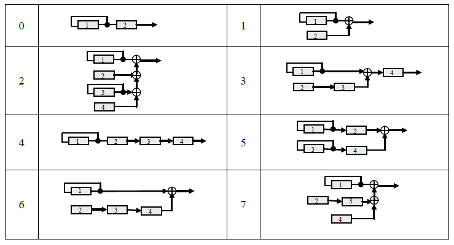
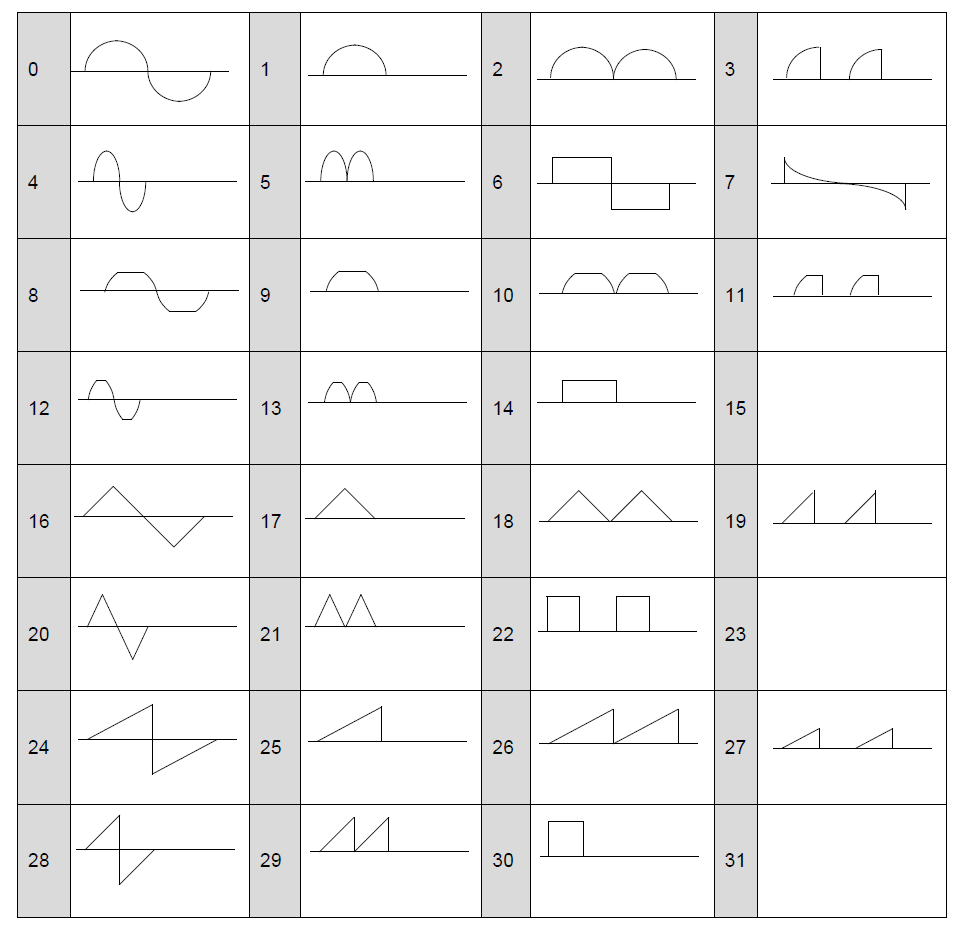

## 音色パラメータ

#### Notes

+ [tn]は「音色番号」を意味します。 Ymf825の音色は最大16です。
+ [op]は「FMオペレータ」を意味します。 Ymf825には、音色に4つのオペレータがあります。 
### BO

|T_ADR|Name|D7|D6|D5|D4|D3|D2|D1|D0|
|-|-|-|-|-|-|-|-|-|-|
|#0+30x[tn]|BO|"0"|"0"|"0"|"0"|"0"|"0"|BO1|BO0|

#### Description
BOは基準オクターブを意味します。 BOはオクターブ設定を制御します。 
+ BO=0 : 2^1
+ BO=1 : 2^0
+ BO=2 : 2^-1
+ BO=3 : 2^-2

### LFO, ALG

|T_ADR|Name|D7|D6|D5|D4|D3|D2|D1|D0|
|-|-|-|-|-|-|-|-|-|-|
|#1+30x[tn]|LFO,ALG|LFO1|LFO0|"0"|"0"|"0"|ALG2|ALG1|ALG0|

#### Description

LFOは低周波発振器の周波数を制御します。 

+ LFO=0 : 1.8Hz
+ LFO=1 : 4.0Hz
+ LFO=2 : 5.9Hz
+ LFO=3 : 7.0Hz

ALGはFMアルゴリズムを意味します。 8つのアルゴリズムを選択できます。 

### SR, XOF, KSR

|T_ADR|Name|D7|D6|D5|D4|D3|D2|D1|D0|
|-|-|-|-|-|-|-|-|-|-|
|#2+30x[tn]+7x[op]|SR, XOF, KSR|SR3|SR2|SR1|SR0|XOF|"0"|"0"|KSR|

#### Description

SRは各オペレーターの持続率を制御します。
SRが0に設定されている場合、サウンドレベルは保持されます。
XOFは、キーオフを無視して制御します。
キーオフが設定されていても、変更は行われません。
KSRは、AEGレートのキースケール感度を意味します。 KSRビットがオンの場合、高いF-numEGレートはより速く変化します。 

### RR, DR

|T_ADR|Name|D7|D6|D5|D4|D3|D2|D1|D0|
|-|-|-|-|-|-|-|-|-|-|
|#3+30x[tn]+7x[op]|RR,DR|RR3|RR2|RR1|RR0|DR3|DR2|DR1|DR0|

#### Description

RRは、各オペレーターのリリースレートを制御します。
DRは、各オペレーターのディケイレートを制御します。 
### AR, SL

|T_ADR|Name|D7|D6|D5|D4|D3|D2|D1|D0|
|-|-|-|-|-|-|-|-|-|-|
|#4+30x[tn]+7x[op]|AR,SL|AR3|AR2|AR1|AR0|SL3|SL2|SL1|SL0|

#### Description

AR controls attack rate of each operator.  
SL controls sustain level of each operator. Sustain Level is the level just after decay rate.
ARは、各オペレーターのアタックレートを制御します。
SLは、各オペレーターのサステインレベルを制御します。
 サステインレベルは、ディケイ直後のレベルです。 
### TL, KSL

|T_ADR|Name|D7|D6|D5|D4|D3|D2|D1|D0|
|-|-|-|-|-|-|-|-|-|-|
|#5+30x[tn]+7x[op]|TL,KSL|TL5|TL4|TL3|TL2|TL1|TL0|KSL1|KSL0|

#### Description
TLは合計レベル（オペレータの出力レベル）を意味します。  
TLはオペレーターレベルを制御します。

KSLは、主要なスケーリングレベルの感度を意味します。自然の楽器では、ピッチが増加するにつれて音量が減衰します。KSLはこの現象をシミュレートします。 
+ KSL=0 : 0
+ KSL=1 : 3dB/oct
+ KSR=2 : 1.5dB/oct
+ KSR=3 : 6.0dB/oct

### DAM, EAM, DVB, EVB

|T_ADR|Name|D7|D6|D5|D4|D3|D2|D1|D0|
|-|-|-|-|-|-|-|-|-|-|
|#6+30x[tn]+7x[op]|DAM,EAM,DVB,EVB|"0"|DAM1|DAM0|EAM|"0"|DVB1|DVB0|EVB|

#### Description

EAMは、振幅変調(AM)を有効にすることを意味します。EAMは振幅変調を設定します。
DAMは振幅変調の深さを意味します。 
+ DAM=0 : 1.3dB
+ DAM=1 : 2.8dB
+ DAM=2 : 5.8dB
+ DAM=3 : 11.8dB

EVBはビブラートを有効にすることを意味します。EVBはビブラートを設定します。  
DVBはビブラートの深さを意味します。 
+ DVB=0 : 3.4cent
+ DVB=1 : 6.7cent
+ DVB=2 : 13.5cent
+ DVB=3 : 26.8cent

### MULTI, DT

|T_ADR|Name|D7|D6|D5|D4|D3|D2|D1|D0|
|-|-|-|-|-|-|-|-|-|-|
|#7+30x[tn]+7x[op]|MULTI, DT|MULTI3|MULTI2|MULTI1|MULTI0|"0"|DT2|DT1|DT0|

#### Description
MULTIはオペレータ周波数の倍率を制御します。 
|MULTI|0|1|2|3|4|5|6|7|8|9|10,11|12,13|14,15|
|-|-|-|-|-|-|-|-|-|-|-|-|-|-|
|magnification|1/2|1|2|3|4|5|6|7|8|9|10|12|15|

DTはデチューンを意味します。 

### WS, FB

|T_ADR|Name|D7|D6|D5|D4|D3|D2|D1|D0|
|-|-|-|-|-|-|-|-|-|-|
|#8+30x[tn]+7x[op]|WS,FB|WS4|WS3|WS2|WS1|WS0|FB2|FB1|FB0|

#### Description
WSは、各オペレーターの基本波形を選択します。  
29種類の波形が選択できます。

FBはFMフィードバックレベルを意味します。
+ FB=0 : 0
+ FB=1 : pi/16
+ FB=2 : pi/8
+ FB=3 : pi/4
+ FB=4 : pi/2
+ FB=5 : pi
+ FB=6 : 2pi
+ FB=7 : 4pi

